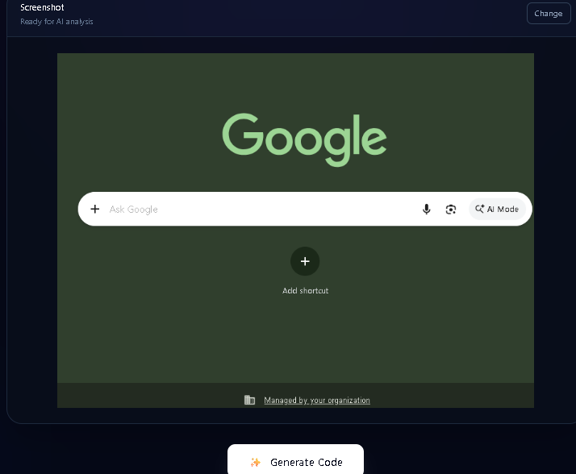
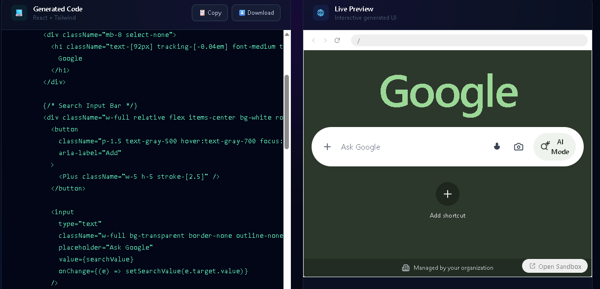

# ⚡ PixelForge AI

### Screenshot → React + Tailwind Code

PixelForge AI is an AI-powered screenshot-to-code generator that transforms website screenshots into functional React and Tailwind CSS interfaces.

Upload a screenshot, let Gemini Vision analyze the design, and PixelForge generates a React component that can be instantly rendered using a live Sandpack preview.

---

## 📸 PixelForge in Action

### 1. Upload a Screenshot

Upload or drag and drop a website screenshot into PixelForge AI.

<p align="center">
  
</p>

### 2. Generated Code & Live Preview

PixelForge AI generates React + Tailwind code and renders the result instantly using the live preview.

<p align="center">
  
</p>


---

## 📸 What is PixelForge AI?

Recreating a website from a screenshot usually requires manually analyzing many visual details such as:

- Layout
- Spacing
- Colors
- Typography
- Components
- Icons
- Borders
- Shadows
- Visual hierarchy

PixelForge AI automates this process using a multimodal AI workflow.

The user simply uploads a screenshot and receives:

```text
Screenshot
     ↓
AI Analysis
     ↓
React + Tailwind Code
     ↓
Live Preview
```

---

## ✨ Features

### 📸 Screenshot Upload

Upload a website screenshot directly through the interface.

### 🖱️ Drag & Drop

Drag and drop an image into the upload area instead of manually selecting a file.

### 🤖 AI-Powered Code Generation

Gemini Vision analyzes the uploaded screenshot and generates a React + Tailwind implementation.

### 🎨 Visual Reconstruction

The AI analyzes and attempts to reproduce:

- Overall layout
- Spacing and positioning
- Colors
- Typography
- Buttons
- Cards
- Inputs
- Icons
- Borders
- Shadows
- Visual hierarchy

### ⚡ Live Preview

Generated React code is executed using Sandpack and displayed as an interactive preview.

### 📋 Copy Code

Copy the generated React code directly to the clipboard.

### ⬇️ Download Code

Download the generated component as a `.jsx` file.

### 🔄 Change Screenshot

Replace the current screenshot without refreshing the application.

### 🛡️ Error Handling

The application handles common problems such as:

- Invalid image uploads
- API errors
- AI generation failures
- Empty generation responses

---

## 🧠 AI Generation

PixelForge AI uses Google's Gemini multimodal model to understand the visual structure of an uploaded screenshot.

Instead of simply asking the model to "convert the screenshot into code", PixelForge uses a structured prompt that guides the model through different visual aspects of the interface.

### Visual Analysis

The model is instructed to analyze:

```text
1. Overall Layout
2. Spacing & Positioning
3. Colors
4. Typography
5. Components
6. Shapes & Styling
7. Responsive Behavior
8. Visual Accuracy
```

This helps the generated UI stay closer to the original screenshot.

---

## 📝 Prompt Engineering

One of the important parts of PixelForge AI is the generation prompt.

The prompt contains specific constraints to reduce unwanted AI-generated UI changes.

For example, the model is instructed to:

- Ignore browser chrome
- Recreate only the actual webpage
- Avoid redesigning the interface
- Avoid inventing additional sections
- Avoid random external images
- Prefer CSS-based visual recreation
- Use Lucide icons when appropriate
- Generate a self-contained React component
- Use Tailwind CSS
- Return only React component code

The goal is to make the model behave more like a frontend reconstruction system rather than a general UI designer.

---

# 🏗️ Architecture

PixelForge AI follows a simple frontend-backend-AI architecture.

```text
                    ┌──────────────────┐
                    │    Screenshot    │
                    └────────┬─────────┘
                             │
                             ▼
                    ┌──────────────────┐
                    │ React +          │
                    │ TypeScript       │
                    │ Frontend         │
                    └────────┬─────────┘
                             │
                             │ HTTP Request
                             ▼
                    ┌──────────────────┐
                    │ FastAPI Backend  │
                    │ Python           │
                    └────────┬─────────┘
                             │
                             ▼
                    ┌──────────────────┐
                    │ Gemini           │
                    │ Multimodal AI    │
                    └────────┬─────────┘
                             │
                             │ Generated JSX
                             ▼
                    ┌──────────────────┐
                    │ React +          │
                    │ Tailwind CSS     │
                    └────────┬─────────┘
                             │
                             ▼
                    ┌──────────────────┐
                    │ Sandpack         │
                    │ Live Execution   │
                    └────────┬─────────┘
                             │
                             ▼
                    ┌──────────────────┐
                    │ Live UI Preview  │
                    └──────────────────┘
```

---

# 🔄 How It Works

The complete generation pipeline works as follows.

### 1. User Uploads Screenshot

The user uploads an image through the React frontend.

The application also supports drag-and-drop uploads.

### 2. Frontend Sends Image

The selected image is stored as a JavaScript `File` object.

The frontend sends the image to the FastAPI backend using `FormData`.

```text
POST /generate
```

### 3. FastAPI Receives Image

The backend receives the uploaded image using FastAPI's `UploadFile`.

The image is read and prepared for the Gemini API.

### 4. Gemini Analyzes Screenshot

The screenshot and structured prompt are sent to Gemini.

Gemini analyzes the visual structure of the interface.

### 5. React Code is Generated

Gemini returns a React component using Tailwind CSS utility classes.

### 6. Backend Processes Response

The backend extracts the generated response and removes unwanted Markdown code fences if necessary.

### 7. Frontend Displays Code

The generated JSX is returned to the React frontend and displayed inside the generated-code section.

### 8. Sandpack Executes Code

The generated React component is passed to Sandpack.

Sandpack runs the generated code and displays the resulting interface.

### 9. User Gets Live Preview

The user can immediately compare the generated interface with the original screenshot.

---

# 🛠️ Tech Stack

## Frontend

- React
- TypeScript
- Vite
- Tailwind CSS
- Lucide React
- Sandpack

## Backend

- Python
- FastAPI
- Uvicorn
- python-multipart
- python-dotenv

## AI

- Google Gemini API
- Gemini multimodal vision capabilities

## Development Tools

- Git
- GitHub
- VS Code
- npm
- Python virtual environment

---

# 📁 Project Structure

```text
pixel-forge-ai/
│
├── frontend/
│   │
│   ├── src/
│   │   ├── components/
│   │   │   └── LivePreview.tsx
│   │   │
│   │   ├── App.tsx
│   │   ├── main.tsx
│   │   └── index.css
│   │
│   ├── public/
│   ├── package.json
│   ├── vite.config.ts
│   └── tsconfig.json
│
├── backend/
│   │
│   ├── src/
│   │   └── server.py
│   │
│   ├── .env
│   ├── .env.example
│   └── requirements.txt
│
├── .gitignore
└── README.md
```

---

# ⚙️ Installation & Setup

## Prerequisites

Before running PixelForge AI, make sure you have installed:

- Node.js
- npm
- Python 3.12+
- Git

You will also need a Gemini API key.

---

## 1. Clone the Repository

```bash
git clone https://github.com/omkarrkr/pixel-forge-ai.git
cd pixel-forge-ai
```

---

# 2. Setup Frontend

Navigate to the frontend directory:

```bash
cd frontend
```

Install dependencies:

```bash
npm install
```

Start the development server:

```bash
npm run dev
```

The frontend will normally run on:

```text
http://localhost:5173
```

---

# 3. Setup Backend

Open another terminal.

Navigate to the backend:

```bash
cd backend
```

Create a Python virtual environment:

```bash
python -m venv .venv
```

### Windows

Activate the virtual environment:

```bash
.venv\Scripts\activate
```

Install backend dependencies:

```bash
pip install -r requirements.txt
```

---

# 4. Configure Gemini API

Create a file named:

```text
backend/.env
```

Add:

```env
GEMINI_API_KEY=your_gemini_api_key_here
```

Replace the placeholder with your actual Gemini API key.

### Important

Never upload your actual API key to GitHub.

The `.env` file is already included in `.gitignore`.

---

# 5. Start the Backend

From the `backend` directory:

```bash
uvicorn src.server:app --reload
```

The backend will normally run on:

```text
http://localhost:8000
```

FastAPI also provides an interactive API documentation page:

```text
http://localhost:8000/docs
```

---

# 🔐 Environment Variables

PixelForge AI uses environment variables to keep API credentials outside the source code.

### `.env`

```env
GEMINI_API_KEY=your_actual_api_key
```

### `.env.example`

```env
GEMINI_API_KEY=your_gemini_api_key_here
```

The real `.env` file should never be committed to GitHub.

---

# 🔒 Security

The Gemini API key is stored on the backend rather than inside the React frontend.

The frontend communicates with the FastAPI backend, and the backend communicates with Gemini.

```text
React Frontend
      │
      │ HTTP Request
      ▼
FastAPI Backend
      │
      │ Gemini API Key
      ▼
Gemini API
```

This prevents the API key from being directly exposed in the frontend source code.

---

# 🎯 Design Goals

PixelForge AI was designed around four main goals.

## 1. Visual Accuracy

Prioritize reproducing the visual structure of the screenshot instead of redesigning it.

## 2. Simple Workflow

The user should be able to go from:

```text
Screenshot → Generate → Preview
```

with minimal interaction.

## 3. Developer-Friendly Code

The generated output should be readable and easy to copy into another React project.

## 4. Fast Feedback

The live preview allows developers to immediately inspect the generated interface without manually creating a separate project.

---

# 📊 Current Capabilities

PixelForge AI currently supports:

| Feature | Status |
|---|---|
| Screenshot Upload | ✅ |
| Drag & Drop | ✅ |
| Screenshot Preview | ✅ |
| Gemini AI Generation | ✅ |
| React Code Generation | ✅ |
| Tailwind CSS Generation | ✅ |
| Live Preview | ✅ |
| Copy Code | ✅ |
| Download Code | ✅ |
| Change Screenshot | ✅ |
| Error Handling | ✅ |

---

# ⚠️ Current Limitations

PixelForge AI is currently an MVP.

Generated results may not always be completely pixel-perfect.

Some limitations include:

- Complex layouts may require manual adjustments.
- Exact fonts may not always be detected.
- Proprietary images or assets cannot always be reproduced from a screenshot.
- Interactive functionality cannot always be inferred from a static screenshot.
- Generated code may require manual cleanup.
- AI interpretation can vary between generations.
- Gemini API usage is subject to API rate limits.
- The current version primarily focuses on single-page screenshot reconstruction.

---

# 🔮 Future Improvements

Potential future improvements include:

- [ ] Multi-page website generation
- [ ] Multiple screenshot support
- [ ] HTML + CSS generation
- [ ] Vue support
- [ ] Better responsive layout generation
- [ ] Asset extraction
- [ ] Editable generated code
- [ ] Regenerate individual sections
- [ ] Natural-language code modifications
- [ ] Version history
- [ ] Export complete React projects
- [ ] User authentication
- [ ] Cloud project storage
- [ ] Screenshot vs generated UI comparison
- [ ] Improved visual similarity scoring

---

# 💡 Why I Built PixelForge AI

PixelForge AI was built to explore how multimodal AI can understand visual interfaces and translate them into functional frontend code.

The project combines:

```text
Computer Vision
      +
Prompt Engineering
      +
Frontend Development
      +
Backend APIs
      +
Live Code Execution
```

Rather than simply calling an AI API, the project focuses on building a complete AI-powered developer workflow.

---

# 🧠 Key Concepts Learned

Building PixelForge AI helped explore several practical concepts:

### Multimodal AI

Understanding how AI models can process both text and images.

### Prompt Engineering

Designing structured prompts to control the format and quality of generated code.

### API Integration

Connecting a React frontend with a Python backend and an external AI API.

### FastAPI

Building lightweight backend APIs for handling image uploads and AI requests.

### Environment Variables

Protecting API credentials using `.env` files.

### Live Code Execution

Using Sandpack to execute and preview generated React code.

### Error Handling

Handling invalid uploads, API errors, and AI generation failures.

### Git & GitHub

Using Git for version control and maintaining the project through GitHub.

---

# 🚀 Future Vision

The long-term idea behind PixelForge AI is to evolve from a simple screenshot-to-code tool into an AI-powered frontend development assistant.

A future version could allow developers to:

```text
Upload Screenshot
       ↓
Generate UI
       ↓
Edit with Natural Language
       ↓
Regenerate Selected Section
       ↓
Preview Changes
       ↓
Export Complete Project
```

For example:

```text
"Make the navbar darker"

"Increase the card spacing"

"Change the primary button to blue"

"Make this section responsive"

"Add a footer similar to the screenshot"
```

The AI could then modify the generated interface based on the developer's instructions.

---

# 👨‍💻 Author

## Omkar Kumar

B.Tech Computer Science & Engineering

Interested in:

- Software Development
- Artificial Intelligence
- Machine Learning
- Full-Stack Development

Built with:

**React • TypeScript • Tailwind CSS • FastAPI • Gemini • Sandpack**

---

# ⭐ Project

If you found PixelForge AI interesting, consider giving the repository a ⭐.
